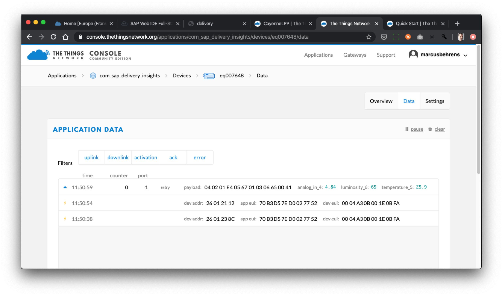
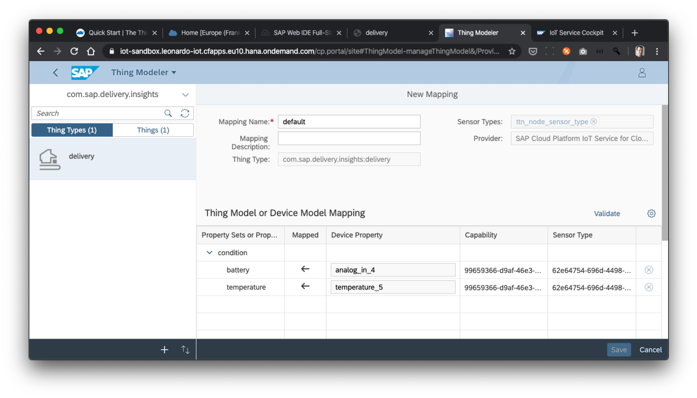
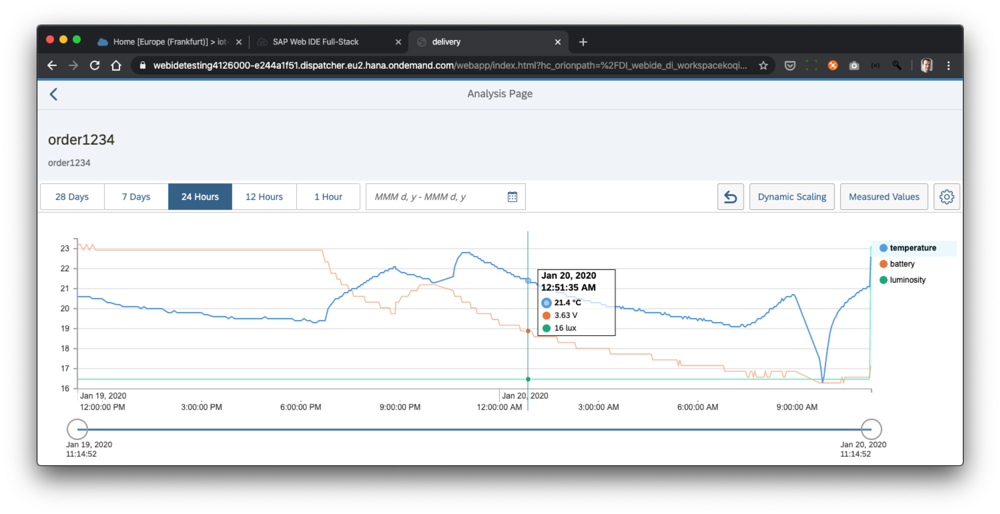
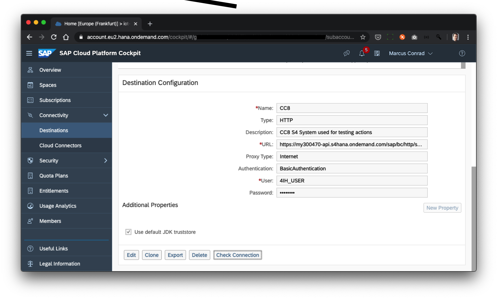
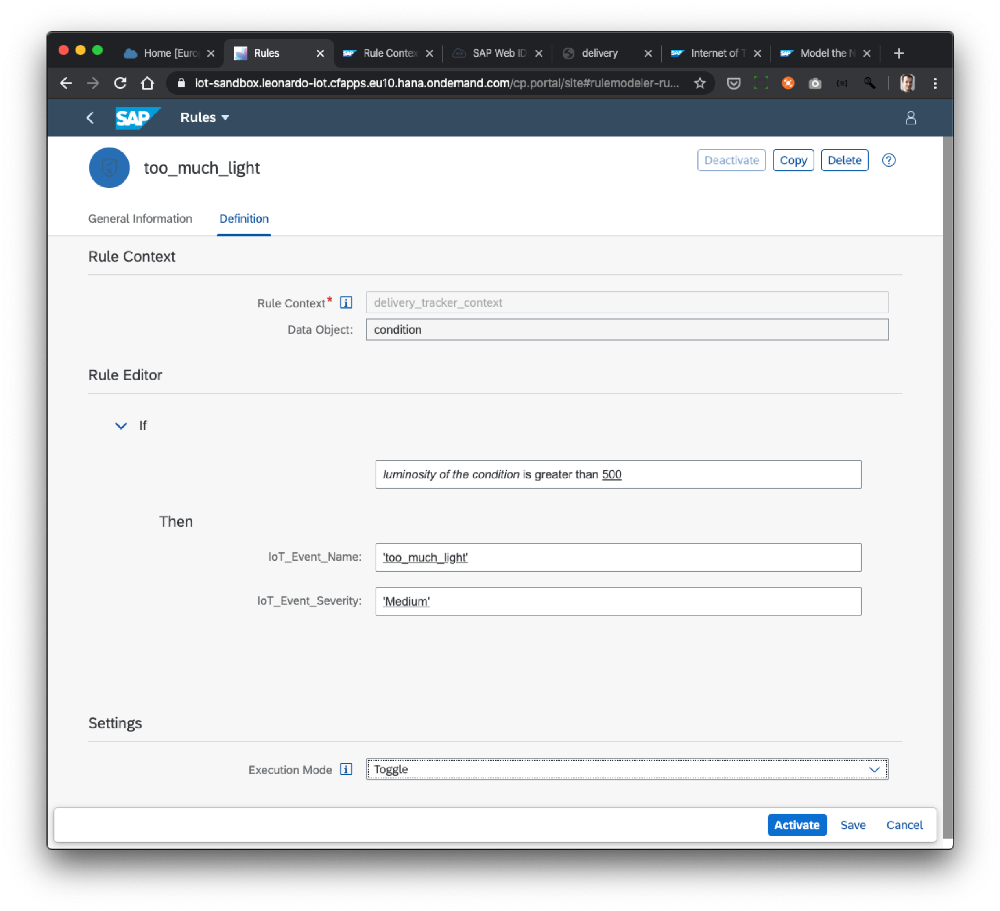

# Description
Receive tracking data from battery powered sensors via the things network, match them to a business process context in SAP Leonardo IoT and trigger automatic updates in SAP ERP. 

## Overview

The Intention of this is to build a solution, that allows deliveries coming from the sales order processing in ERP to be tracked with sensors to allow to find out, if a product that should have been cooled and not exposed to too much light, was actually cooled and protected from light all the way from shipment to receiving.

SAP Leonardo IoT is used for the following functions:

1. Map between device data and business process data during ingestion
2. Storing full time series of both sensor data and business process data for later analysis

See also the powerpoint presentation at the top level of this repository to understand how the data is mapped and to understand the architecture.

This integration was presented and demoed at the things conference january 2020 and a video recording will be made available.

## Prerequisites

1. A (free) account at [https://thethingsnetwork.com/](https://thethingsnetwork.com/)
2. An SAP cloud platform global account with entitlements for Application Runtime, Leonardo IoT and Cloud Platform Internet of Things
3. An SAP S/4 on premise or cloud system or an earlier version of SAP ERP with sales order processing configured and running

## Download, Installation and Configuration

See below step by step guide for instructions.

# Step by Step Guide

## Build a simple tracker application with the things node

1. Purchase one or multiple things nodes at [https://www.thethingsnetwork.org/the-things-products#the-things-product-buy](https://www.thethingsnetwork.org/the-things-products#the-things-product-buy)
2. Follow the Quick start guide to create an application and see data coming in following this guide [https://www.thethingsnetwork.org/docs/devices/node/quick-start.html](https://www.thethingsnetwork.org/docs/devices/node/quick-start.html).
3. Switch to using the battery example ([https://github.com/TheThingsNetwork/arduino-node-lib/tree/master/examples/BatteryMonitorLPP](https://github.com/TheThingsNetwork/arduino-node-lib/tree/master/examples/BatteryMonitorLPP)), put in the appEui from your application and the appKey from your device at the top and add these lines of code to also send the temperature and light just ahead of ttn.sendBytes:
    ```
    float temperature = node->getTemperatureAsFloat();
    debugSerial.print(F("Temperature:\t"));
    debugSerial.print(temperature);
    debugSerial.println(F("Celsius"));
    lpp.addTemperature(5, temperature);

    int light = node->getLight();
    debugSerial.print(F("Light:\t"));
    debugSerial.print(light);
    debugSerial.println(F(""));
    lpp.addLuminosity(6, light);
    ```
1. In the setup() function in the code enable the 2 sensors by adding the following 2 lines after creating the node:

    ```
    node = TheThingsNode::setup();
    node->configLight(true);
    node->configTemperature(true);
    ```
1. In the wake() function also make sure to not disable those 2 sensors. It should look like this:
    ```
    void wake()
    {
    debugSerial.println(F("-- WAKE"));
    }
    ```
1. In the code change the declaration of the variable CayenneLPP lpp(16); to CayenneLPP lpp(51); (we will not send 51 bytes but only those bytes needed)
2. In the console for your application under &quot;Payload Formats&quot; change from &quot;Custom&quot; to &quot;Cayenne LPP&quot;. This will make decoding the different sensor values into properties comprehensive to SAP much simpler.
3. Once you upload the new sketch you can see the data coming through in the ttn console for each device as follows:



## Subscribe to incoming messages from your devices using Node JS

1. Follow this tutorial to create a node js app, that reads all incoming messages from all your tracking devices: [https://www.thethingsnetwork.org/docs/applications/nodejs/quick-start.html](https://www.thethingsnetwork.org/docs/applications/nodejs/quick-start.html)
2. You can now see the data coming through on your computer

## Create Device and Thing Model in SAP Leonardo IoT

1. Follow the first 2 tutorials at [https://developers.sap.com/group.iot-setup-scp-service.html](https://developers.sap.com/group.iot-setup-scp-service.html) to have a device model but
    1. add another capability with name ttn\_env\_tracker\_capability (also use the same as the capability alternate id) and add the following 3 properties to it: analog\_in\_4 (float), temperature\_5 (float), luminosity\_6 (integer) and analog\_in\_7 (float)
    2. use the device id you used in the ttn model as the alternate device id and as the alternate sensor id in the SAP device model
2. Follow the third tutorial but build a thing model that has these additional properties:
    1. basic data properties for the master data from ERP (all string data type):
        1. CUSTOMERID
        2. CUSTOMER_NAME
        1. DELIVERY
        2. DELIVERY_ITEM
        2. HU_ID
        1. MATERIAL
        1. MATERIAL_DESCRIPTION
        1. PURCHASEORDER
        1. PURCHASEORDERITEM
        1. PURCHASEORDERITEMUNIQUEID
        1. SALESORDER
        1. SALESORDERITEM
        1. SALESORDERITEMUNIQUEID
        1. SENSORUNIT
        1. THRESHOLDVALUE
    
    2. measurement properties for battery (float, in Volt), temperature (float, in degrees Celsius), luminosity (integer, in lux)
3.Map them to the properties in the device model as follows (you might have other unmapped properties):

4. You should see data coming in in the Thing Modeler for your &quot;delivery thing&quot; for some of the properties based on the Node JS script used in the second tutorial
5. To be able to see the thing in a template based app make sure to define the current latitude and longitude in the thing modeler ui for it.

## Forward data from TTN devices to SAP Leonardo IoT

We will combine the 2 node js examples to forward data coming from ttn to SAP.

1. Clone or download the zip of this repository to your PC and in a terminal window go to the directory "bridge".

2. You will find a file called "start.js" there - this is a mix of the 2 previous node js examples - on one side its a subscribing client to the ttn mqtt server, on the other side its publishing to the leonardo iot mqtt server.
2. From the SAP Cloud Platform Internet of Things service cockpit create a new MQTT device of type &quot;router device&quot; with &quot;ttn\_router\_device&quot; as its name and download the certificate and passphrase into the bridge/certificates folder in the cloned repository.
3. Update the code with the right file names for certificate and passphrase, your capability alternate id, your host\_address. Also update the file app_list.txt with your ttn appID and accessKey.
4. Run the new node app using &quot;node starts.js&quot;. In the console you can see when it receives data and how it is forwarded to SAP. Check that the data arrives in the SAP device model and that it arrives in the SAP Thing Modeler.

## Deploy the forwarding app to SAP Cloud Platform so it runs contineously

1. Deploy the app to your cloud foundry space in SAP Cloud Platform account into a cloud foundry space using this tutorial: [https://developers.sap.com/tutorials/cp-cf-dev-02-deploy-app.html](https://developers.sap.com/tutorials/cp-cf-dev-02-deploy-app.html) based on the directory you already have. Take the following into account:
2. In the downloaded repository find the manifest.yaml file.

1. Replace in the above the &quot;your\_sap\_user\_here&quot; with your user id to generate a unique host name in your cloud foundry environment (all cloud foundry apps are by default multi-tenant and visible across all companies).
1. Now you can zip all files and directories (except the node\_modules directory) in the directory and upload them to SAP Cloud Platform to run continuously. You can find the console log output in the log of the app in cloud platform.
2. Now 24/7 your data should be forwarded into SAP.

## Analyse the incoming data in SAP&#39;s condition monitoring application template

Follow this tutorial relative to your thing type to see the data coming on from the things node: [https://developers.sap.com/tutorials/iot-express-5-use-webide-template.html](https://developers.sap.com/tutorials/iot-express-5-use-webide-template.html)

Here is an example of how the data over the last 24 hours could look like. During the night battery and temperature both go down continuously and at 6:30 am temperature is rising again – sensor was kept indoors:

 

## Establish a connection between Leonardo IoT and your S4 system

To do this work with your system administrator to get a technical user and password for your system. You should have implemented &quot;4IH: Delivery Insights enabled by IoT&quot; scope item which will result in a new so-called &quot;communication arrangement&quot; with id &quot;SAP\_COM\_0570&quot; being available and then create a destination in your cloud foundry subaccount like this one:

 

## Create a Rule and Action to trigger when threshold is breached

Follow the first 2 steps in the tutorial at [https://developers.sap.com/tutorials/iot-ds-1-define-actions.html](https://developers.sap.com/tutorials/iot-ds-1-define-actions.html). Create a rule context on the thing type (not on the property set). Create a streaming toggle rule that reacts for the illumination to go higher then 500 like this:

 

Then create an action to trigger a call in your S4 system to create a new situation as follows:

    {
    "alias": "IOT_S4_SIT_SO",
    "guid": "1234",
    "data": {
        "device":{
            "customerid": "${S4_References.CUSTOMERID}",
            "customer_name": "${S4_References.CUSTOMER_NAME}",
            "material": "${S4_References.MATERIAL}",
            "material_description": "${S4_References.MATERIAL_DESCRIPTION}",
            "delivery": "${S4_References.DELIVERY}",
            "delivery_item": "${S4_References.DELIVERY_ITEM}",
            "hu_id": "${S4_References.HU_ID}",
            "purchaseorderitemuniqueid": "${S4_References.PURCHASEORDERITEMUNIQUEID}",
            "purchaseorder": "${S4_References.PURCHASEORDER}",
            "purchaseorderitem": "${S4_References.PURCHASEORDERITEM}",
            "salesorder": "${S4_References.SALESORDER}",
            "salesorderitem": "${S4_References.SALESORDERITEM}",
            "salesorderitemuniqueid": "${S4_References.SALESORDERITEMUNIQUEID}",
            "actualvalue": "${Handling_Unit_Condition.Temperature}",
            "thresholdvalue": "${S4_References.THRESHOLDVALUE}",
            "sensorunit": "${S4_References.SENSORUNIT}"
        }
    }
    }

If you use an older version of ERP then you might have to call a different api (called Remote Function Call or short RFC in SAP) with different parameters.

# Further Information

## References

To find developer oriented material please refer to https://community.sap.com/topics/internet-of-things.

One particular sample application that might be also helpful is this one: [https://github.com/SAP-samples/s4hana-cloud-iot-integration-app](https://github.com/SAP-samples/s4hana-cloud-iot-integration-app)

## Limitations and Known Issues

This approach to integration requires you to create a device shadow or twin for every device you create in ttn. At this point of time this is required to allow for the flexible mapping between device properties and thing properties.

With a simple improvement the solution can be used to map multiple different applications in ttn with multiple different use cases in Leonardo IoT. Please refer to the comments in the code to check where it can be improved in this regard.

## Support & Contributing

Please use our community at https://answers.sap.com/tags/73554900100800002247 for questions and answers on this example.

If you have found a material issue with the example please create an issue in this github repo.

Please feel free to put in a pull request and give us some time to review and respond. We likely will update this example as the architecture of Leonardo IoT is changing.

If you have another device management cloud integration in mind please feel free to use the ideas from this example and let us know so we can reference it here.

## License

Copyright (c) 2019 SAP SE or an SAP affiliate company. All rights reserved.
This file is licensed under the SAP Sample Code License except as noted otherwise in the [LICENSE.txt](LICENSE.txt) in this repository.